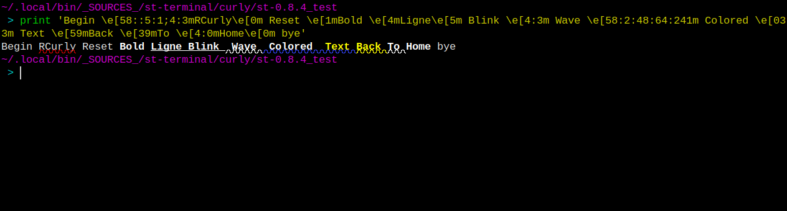
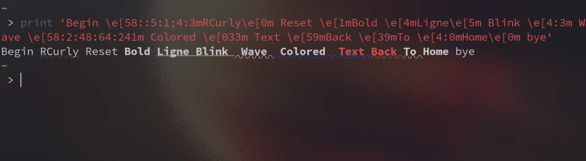

# ST Undercurl

A patch for ST (Simple Terminal) adding support for curly and colored underlines.




# Installation

Install like any other patch. Go into the source directory of ST, and run the
following command:
```shell
patch < ../st-undercurl-0.8.4-20210424.diff
```

Then build it:
```shell
make
```

For installation, you either use Make (recommended):
```shell
make install
```
And you're done!

Or any other method, but in this case, you __HAVE__ to update the `TermInfo` database of
your system, to let terminal programs (Like Vim and such) know that ST supports
special underlines. You do this with the following command:
```shell
tic -sx st.info
```
