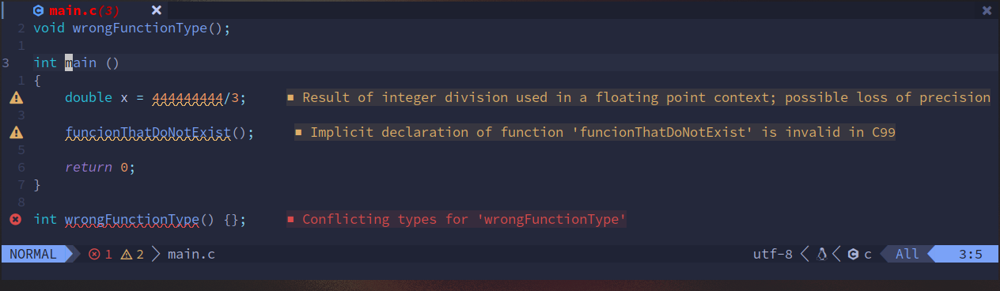
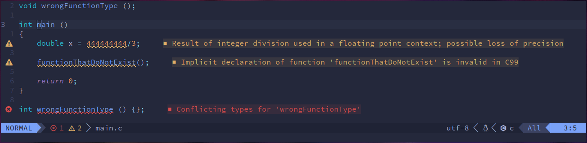
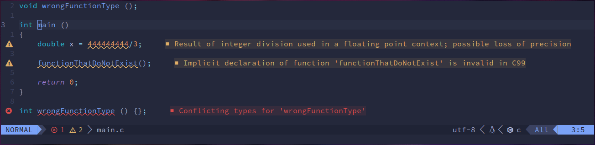

<h1 align="center" style="border-bottom: none;">
	<a href="https://github.com/hexoctal/zenith">ST Undercurl</a>
</h1>
<h3 align="center">A patch for ST (Simple Terminal) adding support for curly and colored underlines.</h3>
<p align="center">
	<a href="#screenshots">Screenshots</a> |
	<a href="#installation">Installation</a>
	<a href="#style">Style</a>
</br>
</br>
<a href=""></a>
<a href="https://github.com/hexoctal/zenith/blob/master/LICENSE.md"></a>
</br>
<a href="https://github.com/hexoctal/st-undercurl/issues"></a>
<a href=""></a>
<a href=""></a>
</br>
</p>

#

## Screenshots




## Installation

Install like any other patch. Go into the source directory of ST, and run the
following command:
```shell
patch < ../st-undercurl-0.8.4-20210424.diff
```

Then build it:
```shell
make
```

For installation, you either use Make (recommended):
```shell
make install
```
And you're done!

Or any other method, but in this case, you __HAVE__ to update the `TermInfo` database of
your system, to let terminal programs (Like Vim and such) know that ST supports
special underlines. You do this with the following command:
```shell
tic -sx st.info
```

## Style

You can choose between three different curly underline styles:

Curly:


Spiky:


Capped:


To change the style, edit the `config.def.h` file, it looks like this:
```cpp
// Available styles
#define UNDERCURL_CURLY 0
#define UNDERCURL_SPIKY 1
#define UNDERCURL_CAPPED 2
// Active style
#define UNDERCURL_STYLE UNDERCURL_CAPPED
```

Just modify `UNDERCURL_STYLE` to one of the three available styles.
